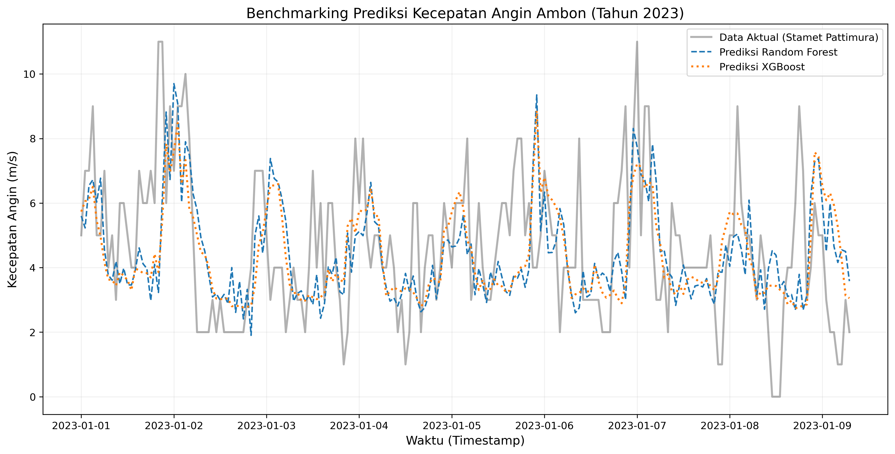
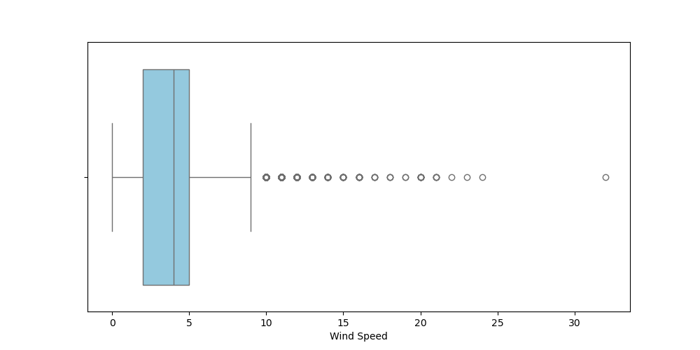
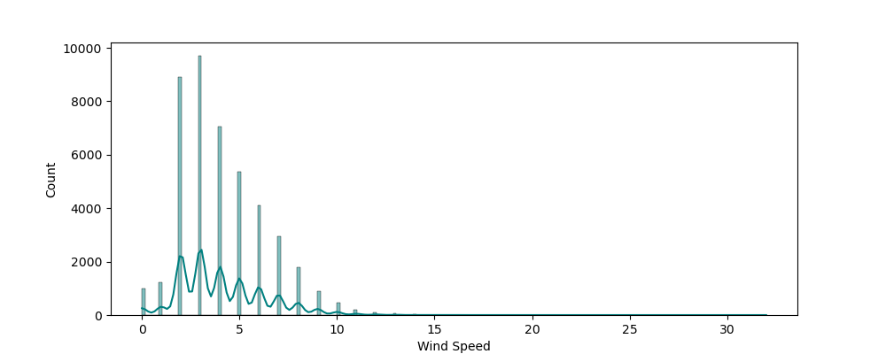

# wind-benchmarking-rf-xgb
Comparative study of Random Forest and XGBoost for short-term wind speed forecasting at Pattimura Meteorological Station, Ambon. Includes time-lag features and cyclical encoding.

# 🌪️ Wind Speed Forecasting: Benchmarking Random Forest vs XGBoost
**Lokasi Studi:** Stasiun Meteorologi (Stamet) Pattimura, Ambon, Indonesia.



## 📌 About The Project
Proyek ini berfokus pada optimasi prediksi kecepatan angin jangka pendek (3 jam ke depan) menggunakan pendekatan *Supervised Machine Learning*. Dengan memanfaatkan data historis cuaca selama 5 tahun (2019-2023), kami melakukan komparasi mendalam antara algoritma berbasis *Bagging* (**Random Forest**) dan *Boosting* (**XGBoost**) untuk menemukan model yang paling adaptif terhadap karakteristik angin di wilayah kepulauan Maluku yang fluktuatif.

---

## 📂 Struktur Proyek
- `Data/`: Dataset mentah, hasil olahan fitur, dan aset visualisasi.
- `Notebooks/`: 
    - `01_Preprocessing.ipynb`: Pembersihan data, interpolasi linear, dan deteksi outlier.
    - `02_Feature_Engineering.ipynb`: Transformasi fitur lag (t-1 s/d t-6) dan fitur waktu siklik.
    - `03_Model_Benchmarking.ipynb`: Eksperimen model, evaluasi metrik, dan visualisasi hasil.
- `README.md`: Laporan komprehensif proyek.
- `requirements.txt`: Dependensi library Python.

---

## 📈 Alur Kerja & Temuan Utama

### Tahap 1: Data Cleaning & Exploratory Data Analysis (EDA)
- **Data Quality:** Menangani *missing values* pada data deret waktu dengan **Interpolasi Linear** untuk menjaga kontinuitas temporal.
- **Outlier Analysis:** Menggunakan metode **IQR** (Interquartile Range) untuk mengidentifikasi 853 data pencilan (> 9.50 m/s). Outlier tetap dipertahankan karena merepresentasikan fenomena angin kencang yang krusial bagi keselamatan penerbangan dan pelayaran di Ambon.

<p align="center">
  
  
</p>

### Tahap 2: Feature Engineering (Rekayasa Fitur)
Untuk memberikan "daya ingat" pada model, kami mengekstrak:
- **Time-Lag Features:** Menggunakan data 6 jam ke belakang sebagai prediktor.
- **Cyclical Features:** Mengonversi jam dan bulan ke dalam koordinat **Sinus/Cosinus** agar model memahami bahwa jam 23:00 dan 00:00 adalah waktu yang berurutan.

### Tahap 3: Model Benchmarking (Hasil Akhir)
Model diuji menggunakan data tahun **2023 penuh** sebagai *unseen data*.

| Model | MAE (m/s) | RMSE (m/s) | R² Score |
| :--- | :---: | :---: | :---: |
| Random Forest | 1.46 | 1.88 | 0.27 |
| **XGBoost** 🏆 | **1.39** | **1.80** | **0.34** |

**Analisis:** **XGBoost** secara konsisten mengungguli Random Forest dengan akurasi variansi (R²) yang lebih tinggi (0.34) dan tingkat kesalahan (MAE) yang lebih rendah. XGBoost terbukti lebih responsif terhadap perubahan kecepatan angin yang mendadak dibandingkan Random Forest yang cenderung lebih konservatif.

---

## 🛠️ Tech Stack & Requirements
Proyek ini dibangun menggunakan Python 3.x dengan library utama:
- **Data Manipulation:** `pandas`, `numpy`
- **Visualization:** `matplotlib`, `seaborn`
- **Machine Learning:** `scikit-learn`, `xgboost`

Instalasi dependensi:
```bash
pip install -r requirements.txt
